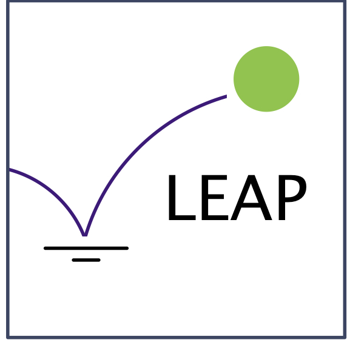

We are group of researchers at the University of British Columbia (UBC) interested in topics at the intersections of health, machine learning, privacy, ethics, and security. We aspire to build usable privacy-enhancing systems that can be readily deployed in healthcare domains. We pursue a variety of projects and collaborations in different domains, some of which are detailed below.

### Current projects

- [Federated health ML systems survey](./systems-survey.md)
- [Explaining differential privacy](./explaining-dp.md)
- [Optimizing privacy budget in differential privacy](./budget-optimization.md)
- [Preserving privacy with data synthesis](./synthesizing-data.md)
- [Federated ML across RedCap databases](./federated-ml-rcap.md)

### Applications of our research

- [Endometriosis](./app-endometriosis.md)
- [Digital pathology](./app-digital-pathology.md)

### People

Our research team includes:

- [Aline Talhouk](http://alinetalhouk.com/) (Professor in the Faculty of Medicine at UBC)
- [Ivan Beschastnikh](https://www.cs.ubc.ca/~bestchai/) (Professor in Computer Science at UBC)
- [Mathias Lécuyer](http://mathias.lecuyer.me/) (Professor in Computer Science at UBC)
- [Jean-Francois Rajotte](https://scholar.google.com/citations?user=rDYYdUUAAAAJ&hl=en) (Resident Data Scientist at UBC)

We work with a fantastic group of students:

- Matheus Stolet (CS MSc)
- Kalli Leung (Directed studies, USRA'20)
- Mishaal Kazmi (CS PhD-Track)
- Jed Yeo (Engineering Physics)

Student alumni:

- Ahmed Abdelmoneim (CS Honors)
- Aditya Chinchure (WLIUR'20)
- Chris West (CS Honours)
- Chris Yoon (Med student)
- Daisy Zhang (Directed studies, SURE'20)

### Recent publications

- *“Development and validation of the gene-expression Predictor of high-grade-serous Ovarian carcinoma molecular subTYPE (PrOTYPE)”.* A Talhouk, J George, C Wang, T Budden, T Z Tan, P D P Pharoah, G E Konecny, E L Goode, S J Ramus, J A Doherty, DD Bowtell, M S Anglesio, and the Ovarian Tumor Tissye Analysis Consortium. (2020). Clinical Cancer Research, to appear.
- *"Privacy Accounting and Quality Control in the Sage Differentially Private ML Platform."* Mathias Lécuyer, Riley Spahn, Kiran Vodrahalli, Roxana Geambasu, Daniel Hsu. (SOSP 2019) 
- *"The Limitations of Federated Learning in Sybil Settings."* Clement Fung, Chris J.M. Yoon, Ivan Beschastnikh. (RAID 2020)
- *"Private data sharing between decentralized users through the PrivGAN architecture.* Jean-Francois Rajotte, Raymond T. Ng (PriSEM 2020)"

### Funding

We are grateful to NSERC, MSFHR, CIHR, UBC Data Science Intitute, and UBC Faculty of Science for their support.

