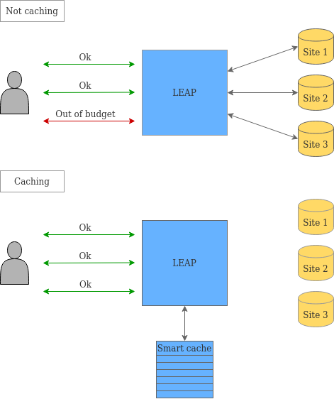

## Optimizing privacy budget in differential privacy

Differential privacy gives formal guarantees to prevent privacy violations that may occur when computing on sensitive datasets. Queries can be issued to a system and a differentially private mechanism guarantees that leakage of information will be mitigated. To be effective, a system with differential privacy must constrain the number of queries that a user can issue. In other words, the system must set a privacy budget to limit  the number of queries. With each query the system knows how much of the budget was used. When the budget is depleted, users are not allowed to make more queries, or else the system risks revealing too much about the underlying data.

This project optimizes the use of the privacy budget so that users can extract more utility from a system with differential privacy guarantees. We do this by implementing a smart cache, where we identify queries that a user has made in the past, and return a cached result instead of computing a new answer and spending the budget. Furthermore, new queries are extrapolated from prior query results, thus consuming only a small amount of the budget.

  

