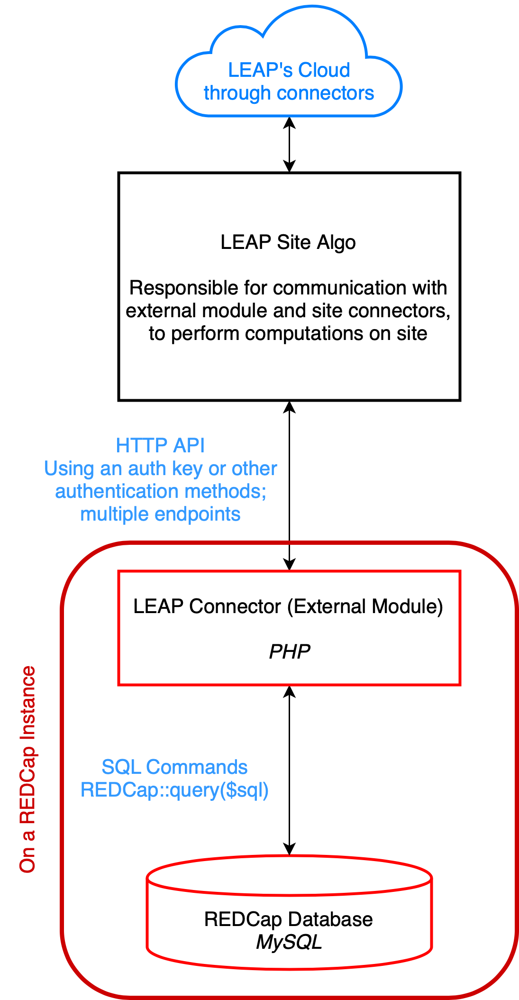

## Federated machine learning across RedCap databases

REDCap is one of the most popular database tools for research and survey applications with over 1.3 millions users [[1]](https://www.project-redcap.org). It is primarily used in healthcare research to collect and store data for projects. One of the goals of LEAP is to allow multiple data sources to contribute to data analysis in a privacy focused, federated manner. REDCap is a critical data source for LEAP; therefore, the goal of this project is to connect REDCap to LEAP and to implement federated ML algorithms across multiple REDCap instances through LEAP. 

  

There are two primary objectives in this project:
1. Build a LEAP Connector module for REDCap. This is an External Module [[2]](https://github.com/vanderbilt/redcap-external-modules) that can be installed on any REDCap instance, and will provide LEAP with API-based access to the underlying MySQL database.
2. Implement federated statistical and machine learning algorithms that will allow computations to be mapped to the sites and the results to be aggregated in the cloud. The focus of this objective is to optimize the federated ML pipeline to work with REDCap databases.

### References:
1. Project REDCap: https://www.project-redcap.org
2. REDCap External Modules: https://github.com/vanderbilt/redcap-external-modules
