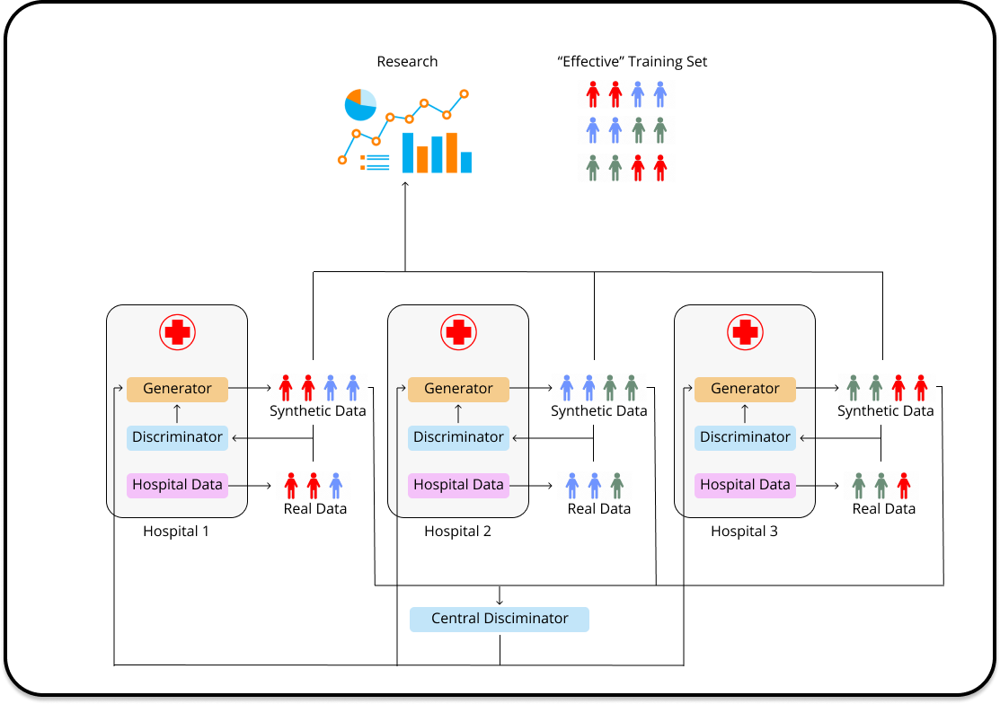

## Preserving privacy with data synthesis

Legitimate privacy concerns often limit access to large datasets either by requiring a very lengthy approval process or by allowing access to only a small number of dedicated servers (e.g. within a hospital). However, to unleash the full power of various machine learning techniques, we need to find ways to share and pool data among research groups, while adhering to strict measures of confidentiality.

  

Our group is investigating the feasibility of privacy-preserving synthetic data generation. We are interested in broad, theory-backed approaches that can apply to real-life situations, especially those found in the healthcare setting. For example, allowing researchers the utility of access to sensitive data without violating patient privacy.

  

In particular, we are looking at:

  

* Private synthetic data generation from adversarial GAN training (using the PrivGAN framework, found [here])(https://arxiv.org/abs/2001.00071v3)

* Evaluate the utility impact of adding differential privacy to synthetic data generation for strong privacy guarantees

* Creating synthetic datasets in a Federated Learning setting

* Evaluate the utility of synthetic data in a variety of realistic scenarios

  

We are exploring situations in which our framework for private synthetic data generation can provide robust protection against privacy attacks , while still providing utility close to that of real data. Furthermore, the framework aims to operate in a federated setting, so that the user has access to a larger set of data than can be found in any one location. This protects against common issues in data science, such as overfitting and data imbalance.

  

  

  

The general idea is that local data imbalances can be countered with a central discriminator which penalizes overfitting to the local distribution. This has an effect of training local generators to create synthetic data which does not readily reveal its source, thus providing a baseline level of privacy above that of real data. The utility of this privacy will be the main focus of the Privacy-Preserving Data Synthesis project.
